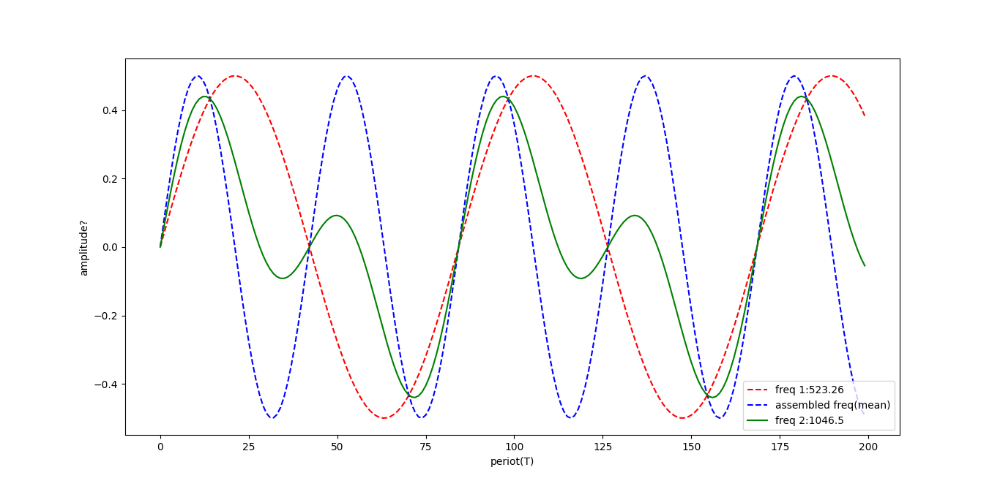

# simple-sound-generator
1. very simple sine waves generator program to produce sound.
  * _Environment: Ubuntu/GNU-Linux; g++ ;compile the program with Makefile_
    * _'make all' command compiles and places code to a directory_
    * _'make remove' command deletes directory. Or you can delete directory manually_
* "nenni bebek.wav" :
  * A folk song from the Tunceli region of Turkey.
  * Produced by using the program
* "sound_assemble.py" and "sound_assemble.png" :
  * To visualise the combining of different sound frequencies into one. Idea will be implement later
  * sound assemble.py plots sample frequencies on window. .png is output of this code.
  * 
